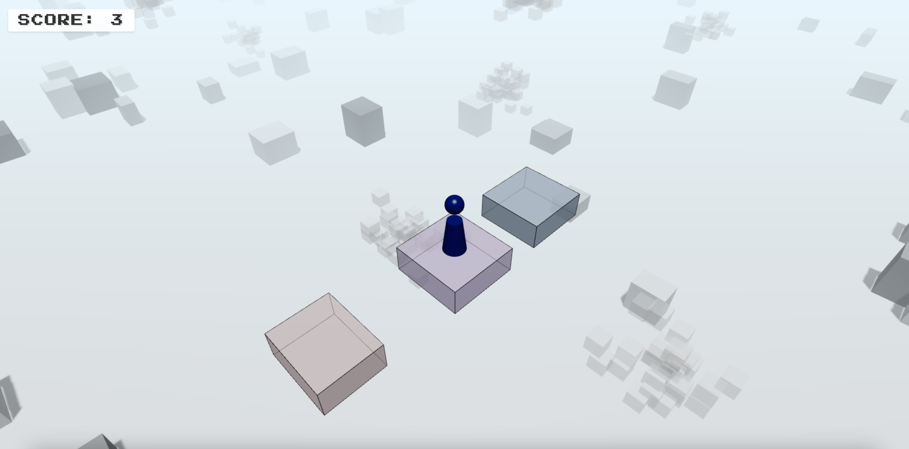

# 跳一跳游戏 (Jump Game)

一个基于Three.js开发的3D跳一跳游戏，类似于经典的微信小游戏。通过控制按压时间来决定跳跃力度，目标是让角色跳到下一个平台上，获取尽可能高的分数。



## 功能特点

- 3D图形渲染与物理模拟
- 基于按压时间的跳跃力度控制
- 平台随机生成系统
- 完整的游戏循环（开始、游戏中、结束状态）
- 实时分数计算与显示
- 粒子特效系统
- 像素风格UI界面
- 8-bit风格音效
- 跨平台支持（PC与移动设备）
- AI图像生成与地面纹理替换

## 技术栈

- **前端框架**：React + TypeScript
- **3D引擎**：Three.js
- **构建工具**：Vite
- **物理引擎**：Cannon.js
- **状态管理**：Zustand
- **音效处理**：Web Audio API
- **网络通信**：Socket.IO（多人模式准备中）
- **AI图像生成**：腾讯混元大模型API

## 安装与运行

### 环境要求

- Node.js 18.0+
- npm 8.0+

#### Windows安装Node.js

1. **使用安装包（推荐）**：
   - 访问[Node.js官网](https://nodejs.org/)
   - 下载并安装LTS（长期支持）版本
   - 安装过程中保持默认选项即可
   - 安装完成后，打开命令提示符或PowerShell验证安装：
     ```
     node -v
     npm -v
     ```

2. **使用NVM for Windows**：
   - 下载[NVM for Windows](https://github.com/coreybutler/nvm-windows/releases)
   - 安装NVM
   - 打开PowerShell或命令提示符，执行：
     ```
     nvm install 18.20.0
     nvm use 18.20.0
     ```

#### macOS安装Node.js

1. **使用Homebrew（推荐）**：
   - 安装[Homebrew](https://brew.sh/)（如果尚未安装）：
     ```bash
     /bin/bash -c "$(curl -fsSL https://raw.githubusercontent.com/Homebrew/install/HEAD/install.sh)"
     ```
   - 使用Homebrew安装Node.js：
     ```bash
     brew install node@18
     ```
   - 添加到PATH（如果需要）：
     ```bash
     echo 'export PATH="/usr/local/opt/node@18/bin:$PATH"' >> ~/.zshrc
     source ~/.zshrc
     ```

2. **使用NVM**：
   - 安装NVM：
     ```bash
     curl -o- https://raw.githubusercontent.com/nvm-sh/nvm/v0.39.5/install.sh | bash
     ```
   - 在终端中安装并使用Node.js 18：
     ```bash
     nvm install 18
     nvm use 18
     ```

3. **使用安装包**：
   - 访问[Node.js官网](https://nodejs.org/)
   - 下载macOS安装包并安装

### 安装步骤

```bash
# 克隆仓库
git clone https://github.com/你的用户名/jump-game.git

# 进入项目目录
cd jump-game

# 安装依赖
npm install

# 方法一：一键启动（同时启动生图服务和游戏）
npm run dev:all

# 方法二：分步启动（推荐用于调试）
# 1. 先启动生图服务
node demoFiles/imageGenerationServer.js

# 2. 再启动游戏（在新的终端窗口中）
npm run dev -- --host
```

启动开发服务器后，如果一切正常，终端将显示本地访问地址（通常是 `http://localhost:5173/`）。在浏览器中打开这个地址，就可以看到游戏画面并开始游玩了。

如果您想在同一网络下的其他设备（如手机）上访问游戏，请确保使用 `--host` 参数启动服务器，如方法二所示。

> **注意**：生图服务需要腾讯云的密钥环境变量 `TENCENT_SECRET_ID` 和 `TENCENT_SECRET_KEY`。请确保这些环境变量已正确设置。

### 构建生产版本

```bash
# 构建优化后的生产版本
npm run build

# 预览生产版本
npm run preview
```

## 游戏操作

- **PC设备**：鼠标按下开始蓄力，释放跳跃
- **移动设备**：触摸屏幕开始蓄力，抬起手指跳跃
- 按压时间越长，跳跃距离越远
- 成功落在平台上得分，掉落则游戏结束
- 游戏结束后点击"RESTART"按钮重新开始

## 项目结构

```
jump-game/
├── public/            # 静态资源
├── src/
│   ├── components/    # React组件
│   ├── game/          # 游戏核心逻辑
│   │   ├── audio.ts   # 音效系统
│   │   ├── engine.ts  # 游戏引擎
│   │   ├── particles.ts # 粒子系统
│   │   ├── platform.ts # 平台系统
│   │   └── player.ts  # 玩家控制
│   ├── App.tsx        # 应用主组件
│   └── main.tsx       # 入口文件
├── demoFiles/         # 演示文件
│   └── imageGenerationServer.js # 生图服务器
├── index.html         # HTML模板
├── package.json       # 项目配置
├── tsconfig.json      # TypeScript配置
└── vite.config.ts     # Vite配置
```

## 开发计划

- [x] 基础3D场景
- [x] 角色系统
- [x] 基础平台
- [x] 跳跃机制
- [x] 得分系统
- [x] 音效系统
- [x] 粒子特效
- [x] 游戏UI
- [x] 支持高阶玩家，基于AI能力对游戏素材和玩法进行创意改编

## 开发日志

### 2025年2月28日
- **添加AI图像生成功能**：
  - 集成腾讯混元大模型API，实现文本到图像的生成功能
  - 添加侧边栏界面，支持设置提示词、风格、分辨率等参数
  - 实现图像生成任务提交和状态查询功能
  - 添加生成图像展示和下载功能
- **实现地面纹理替换**：
  - 添加"替换"按钮，允许将生成的图像应用为地面纹理
  - 优化纹理加载和应用过程，确保图像质量
  - 调整材质参数和光照设置，使纹理颜色更加鲜艳
  - 解决跨域资源共享(CORS)问题，确保外部图像资源可用
- **改进开发环境**：
  - 添加混元生图服务自动启动功能
  - 创建统一的开发启动脚本，同时启动游戏和图像服务
  - 添加图像代理API，解决浏览器跨域限制

### 2023年11月15日
- **增强音效系统**：
  - 添加了8-bit风格的游戏开始音效，使用三层音轨（主旋律、和声和低音）创建欢快的C大调上升音阶
  - 实现了蓄力音效系统，音调随蓄力程度升高，提供直观的力度反馈
  - 添加了最大蓄力提示音，当玩家达到最大蓄力时播放通知音效
- **优化角色动画**：
  - 改进了跳跃过程中的翻转动画，使其与跳跃进度同步
  - 确保角色在整个跳跃过程中完成一个完整的360度翻转
- **修复了多个bug**：
  - 解决了地面移动计算中的语法错误
  - 修复了音频上下文激活问题，确保在所有浏览器中正常工作
  - 优化了游戏引擎中的调试输出

## 跨平台开发注意事项

本项目支持在Windows、Mac和Linux环境下开发：

- 代码使用跨平台兼容的路径处理
- 配置文件采用LF行尾
- 使用.gitignore排除环境相关文件
- 提供Docker配置用于一致的开发环境（计划中）

## 贡献指南

1. Fork本仓库
2. 创建特性分支 (`git checkout -b feature/amazing-feature`)
3. 提交更改 (`git commit -m 'Add amazing feature'`)
4. 推送到分支 (`git push origin feature/amazing-feature`)
5. 创建Pull Request

## 许可

本项目采用MIT许可证 - 详见 [LICENSE](LICENSE) 文件
