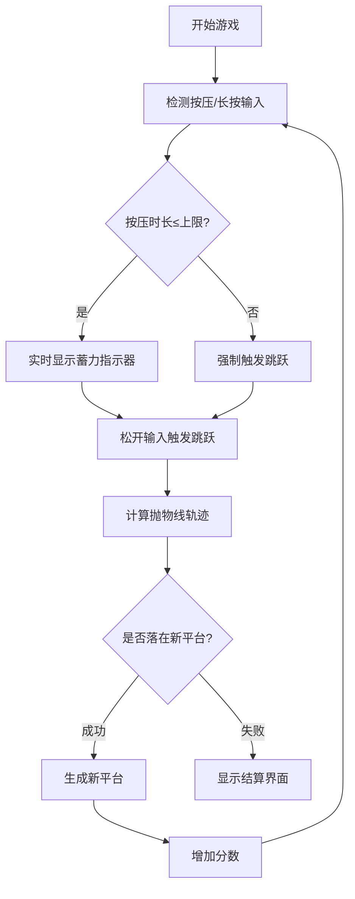
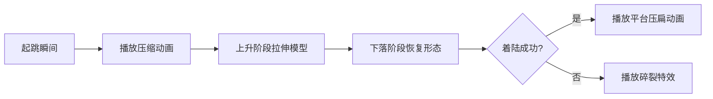

# 跳一跳核心玩法技术策划方案

## 一、核心机制流程图


## 二、核心参数配置表

| 参数名称          | 默认值  | 说明                          | 计算公式                     |
|-------------------|---------|-----------------------------|----------------------------|
| 按压时间上限      | 2000ms  | 超过该时长自动触发跳跃          | -                         |
| 基础跳跃系数      | 0.8px/ms | 单位时间对应的跳跃距离          | 距离 = 按压时间 * 系数    |
| 抛物线高度系数    | 0.5      | 跳跃抛物线顶点高度              | y = -4h(x/d - 0.5)^2 + h  |
| 平台生成范围      | ±30%     | 新平台相对当前跳跃距离的偏移范围 | 新距离 = d * (0.7~1.3)    |
| 着陆判定区域      | 60%      | 平台有效区域的百分比            | 有效区 = 平台宽度 * 0.6   |

## 三、核心模块实现细节

### 1. 输入控制模块
```javascript
class InputController {
  constructor() {
    this.pressStartTime = 0;
    this.isPressing = false;
    
    // 绑定事件
    canvas.addEventListener('mousedown', this.onPressStart);
    canvas.addEventListener('mouseup', this.onPressEnd);
    // 移动端适配
    canvas.addEventListener('touchstart', this.onPressStart);
    canvas.addEventListener('touchend', this.onPressEnd);
  }

  onPressStart = () => {
    this.pressStartTime = Date.now();
    this.isPressing = true;
    this.showPowerIndicator(); // 显示蓄力条
  }

  onPressEnd = () => {
    if(!this.isPressing) return;
    
    const pressDuration = Date.now() - this.pressStartTime;
    this.triggerJump(Math.min(pressDuration, MAX_PRESS_TIME));
    this.isPressing = false;
  }
}
```

### 2. 跳跃物理计算
```typescript
interface JumpResult {
  success: boolean;
  distance: number;
  trajectory: Vector3[];
}

class PhysicsEngine {
  calculateJump(pressTime: number): JumpResult {
    const actualTime = Math.min(pressTime, MAX_PRESS_TIME);
    const baseDistance = actualTime * BASE_JUMP_RATE;
    const windFactor = this.getWindInfluence(); // 预留环境因素影响
    
    // 抛物线运动分解
    const jumpDistance = baseDistance * (1 + windFactor);
    const peakHeight = jumpDistance * PEAK_HEIGHT_RATIO;
    
    return {
      distance: jumpDistance,
      trajectory: this.calculateParabolaPoints(jumpDistance, peakHeight)
    };
  }

  private calculateParabolaPoints(d: number, h: number): Vector3[] {
    const points = [];
    for(let x = 0; x <= d; x += d/10) {
      const y = -4*h*Math.pow((x/d - 0.5), 2) + h;
      points.push(new Vector3(x, y, 0));
    }
    return points;
  }
}
```

### 3. 平台生成逻辑
```javascript
class PlatformGenerator {
  constructor() {
    this.platformPool = new ObjectPool(() => new Platform(), 10);
  }

  generateNextPlatform(currentDistance) {
    const platform = this.platformPool.acquire();
    
    // 计算随机位置
    const min = currentDistance * 0.7;
    const max = currentDistance * 1.3;
    const nextDistance = currentDistance + randomBetween(min, max);
    
    // 随机平台类型（基础版）
    platform.type = Math.random() > 0.2 ? 'normal' : 'special';
    platform.position = new Vector3(nextDistance, 0, 0);
    
    // 设置碰撞体
    platform.collider.size = new Vector3(
      BASE_SIZE * randomBetween(0.8, 1.2),
      0.1,
      BASE_SIZE
    );
    
    return platform;
  }
}
```

## 四、关键视觉反馈设计

### 1. 蓄力指示系统
| 元素          | 表现方式                          | 动态变化规则                  |
|---------------|---------------------------------|-----------------------------|
| 蓄力条        | 屏幕底部渐变色进度条              | 宽度随按压时间线性增长        |
| 棋子特效      | 粒子发射器强度变化                | 粒子密度与按压时间成正比      |
| 预测轨迹线    | 半透明抛物线+落点指示圈           | 实时计算显示，超过上限时变红  |

### 2. 跳跃过程反馈


## 五、碰撞检测方案
```typescript
class CollisionSystem {
  checkLanding(character: Character, platform: Platform): boolean {
    // 获取底部碰撞器
    const charBounds = character.getBottomBounds();
    const platformBounds = platform.getTopBounds();

    // 计算有效着陆区域
    const safeZone = platformBounds.width * SAFE_ZONE_RATIO;
    const centerX = platformBounds.center.x;
    
    return charBounds.min.x > (centerX - safeZone/2) && 
           charBounds.max.x < (centerX + safeZone/2);
  }
}
```

## 六、性能优化要点
1. **对象池技术**：平台实例复用，避免频繁GC
2. **轨迹预测优化**：使用贝塞尔曲线替代精确物理计算
3. **按需渲染**：角色离开屏幕的旧平台切换为低模
4. **WebWorker应用**：物理计算在独立线程执行
5. **GPU Instancing**：批量渲染相同材质的平台
```javascript
// GPU实例化示例（Three.js）
const platformGeometry = new THREE.InstancedBufferGeometry();
const material = new THREE.MeshStandardMaterial();
const mesh = new THREE.InstancedMesh(platformGeometry, material, 100);
```

## 七、开发进展记录

### Day 1 进展 (2024-02-21)

#### 已完成功能
1. **基础场景搭建**
   - 实现了等轴测视角的3D场景
   - 添加了坐标轴和网格辅助线
   - 配置了光照和阴影系统

2. **角色系统**
   - 创建了基础的角色模型（圆柱体身体、球形头部）
   - 实现了悬浮小球动画
   - 添加了按压时的形变动画

3. **平台系统**
   - 实现了基础平台（起始平台和目标平台）
   - 添加了平台下落和弹跳动画
   - 完成了平台碰撞检测逻辑

4. **核心跳跃机制**
   - 实现了长按蓄力系统
   - 完成了跳跃距离计算
   - 添加了抛物线轨迹动画
   - 优化了跳跃速度计算（固定速度8米/秒）
   - 实现了落点判定和得分系统

#### 待优化项目
1. **跳跃手感**
   - 可能需要微调JUMP_SPEED（当前8米/秒）
   - 考虑调整JUMP_HEIGHT_RATIO（当前0.225）

2. **视觉效果**
   - 考虑添加跳跃轨迹预览
   - 可以优化蓄力动画效果
   - 需要改进阴影效果

3. **判定机制**
   - 可以添加完美落地判定
   - 考虑增加连击奖励系统

#### 明日开发计划
1. 实现跳跃轨迹预览功能
2. 添加完美落地判定机制
3. 优化视觉反馈效果
4. 开始开发第三个平台的生成逻辑

#### 技术难点记录
1. 光源位置和阴影方向的关系：光源在正方向，阴影投射在反方向
2. 跳跃时长计算：改用固定速度（8米/秒）来计算，而不是固定时长
3. 平台碰撞检测：使用简单的矩形范围检测，后续可能需要优化